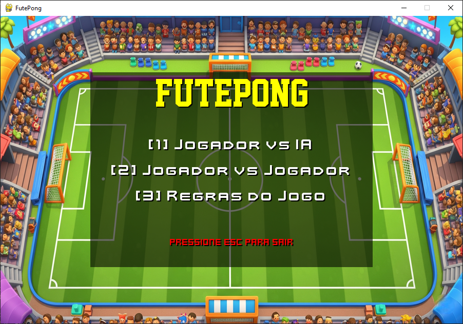
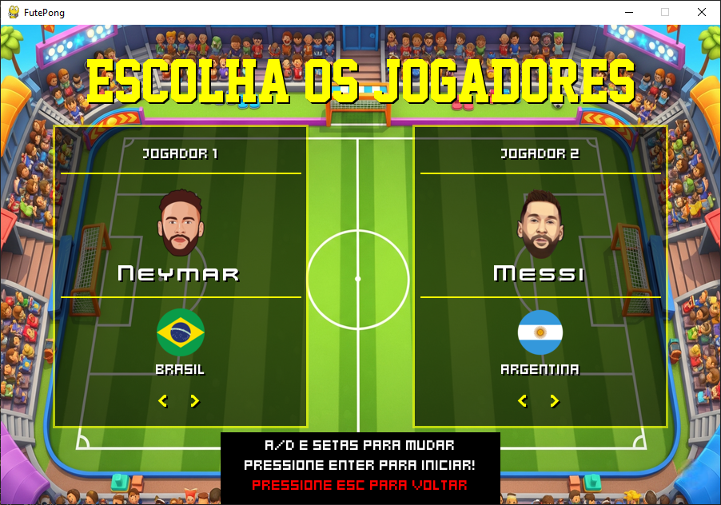
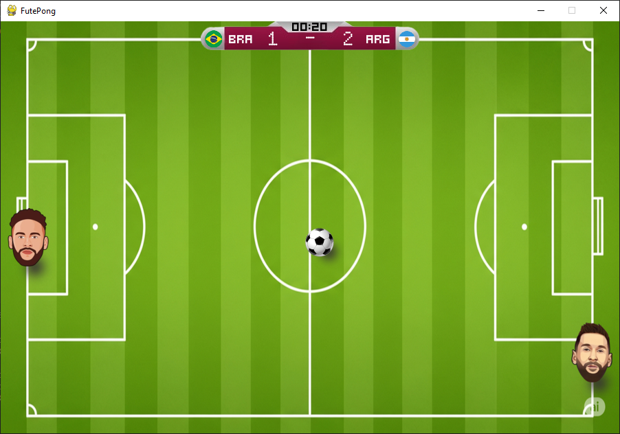

# ⚽ FutePong

| Tela Inicial | Seleção de Personagens | Partida em Andamento |
|:---:|:---:|:---:|
|  |  |  |

Um clássico jogo de Pong reimaginado com a paixão e a emoção do futebol! Escolha entre craques mundiais, use power-ups e dispute partidas eletrizantes contra a IA ou um amigo.

---

## ✨ Funcionalidades

* **Modos de Jogo:** Dispute partidas no modo **Jogador vs IA (PVE)** ou desafie um amigo em **Jogador vs Jogador (PVP)**.
* **Seleção de Personagens:** Jogue com representações de 6 craques do futebol mundial, cada um com sua respectiva bandeira.
* **IA com Dificuldade Ajustável:** A inteligência artificial pode ser configurada nos níveis Fácil, Médio ou Difícil.
* **Power-Ups Dinâmicos:** Power-ups de aumento de velocidade (🔥) e normalização de velocidade (❄️) aparecem aleatoriamente durante a partida para mudar o ritmo do jogo.
* **"Game Juice" e Animações:**
    * **Squash and Stretch:** Os jogadores se achatam e esticam ao rebater a bola, dando mais vida ao impacto.
    * **Tilt:** Os jogadores se inclinam na direção do movimento.
    * **Screen Shake:** A tela treme a cada gol, aumentando a emoção.
    * **Ball Trail:** A bola deixa um rastro quando está em alta velocidade.
* **Interface Gráfica Completa:** Menus bem desenhados, tela de regras, tela de seleção, tela de pause funcional e tela de fim de jogo.
* **Efeitos Sonoros:** Apito inicial/final, chute na bola e som de gol para uma maior imersão.

---

## 🔧 Tecnologias Utilizadas

* **Linguagem:** Python 3.11
* **Bibliotecas Principais:**
    * [Pygame](https://www.pygame.org/) - A base para toda a lógica de jogo e renderização.
    * [PPlay Game Engine](https://github.com/pplay-gengine/pplay) - Uma biblioteca wrapper sobre o Pygame para facilitar a manipulação de sprites e janelas.
    * [Pillow](https://python-pillow.org/) - Utilizada para carregar e processar os frames da animação de gol em formato GIF.

---

## 🚀 Como Executar o Projeto

Siga os passos abaixo para rodar o FutePong na sua máquina local.

### Pré-requisitos

* Python 3.8 ou superior instalado.
* `pip` (gerenciador de pacotes do Python).

### Instalação

1.  **Clone o repositório:**
    ```sh
    git clone https://github.com/MateusFerreiraM/Futepong.git
    cd Futepong
    ```

2.  **Crie um Ambiente Virtual (Recomendado):**
    Isso isola as dependências do seu projeto e evita conflitos com outros projetos Python.
    ```sh
    python -m venv venv
    ```
    Ative o ambiente:
    * No Windows: `.\venv\Scripts\activate`
    * No macOS/Linux: `source venv/bin/activate`

3.  **Instale as dependências:**
    As bibliotecas necessárias estão listadas no arquivo `requirements.txt`. Para instalá-las, rode:
    ```sh
    pip install -r requirements.txt
    ```

4.  **Execute o Jogo:**
    Com as dependências instaladas, basta executar o arquivo principal.
    ```sh
    python main.py
    ```

---

## 🎮 Como Jogar

* **Objetivo:** Marcar o número máximo de gols (`MAX_SCORE`) antes do seu oponente.
* **Controles:**
    * **Jogador 1:** `W` (para cima) e `S` (para baixo).
    * **Jogador 2 (Modo PVP):** `Seta para Cima` e `Seta para Baixo`.
    * **Pausar:** `P` durante a partida para abrir o menu de pause.

---

## 📂 Estrutura de Arquivos

O projeto foi organizado de forma modular para facilitar a manutenção e escalabilidade:

```
.
├── boost/
├── flags/
├── fonts/
├── images/
├── players/
├── sounds/
├── constants.py
├── entities.py
├── game.py
├── main.py
├── ui_manager.py
├── requirements.txt
├── LICENSE
└── README.md
```

---

## 📄 Licença

Este projeto está sob a licença MIT. Veja o arquivo `LICENSE` para mais detalhes.
